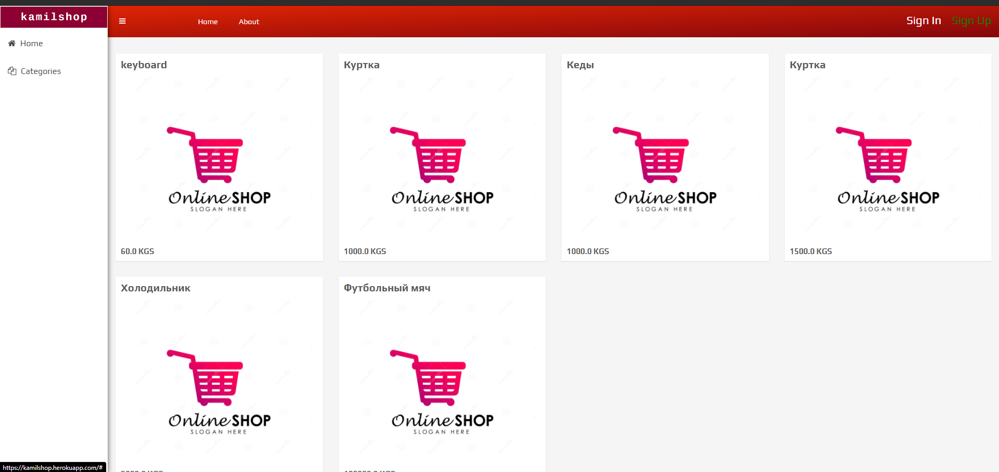
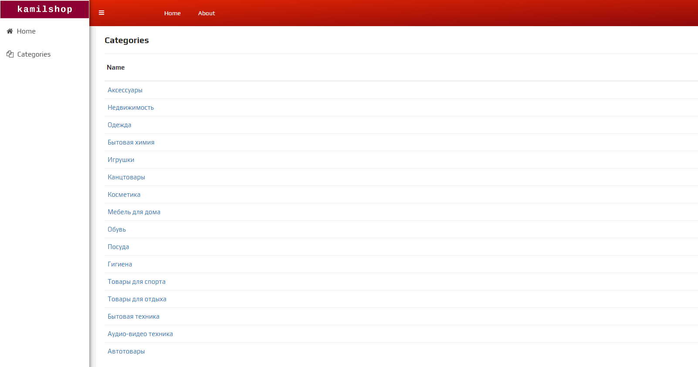
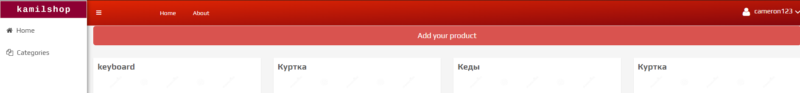
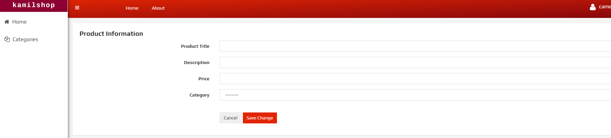
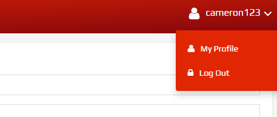
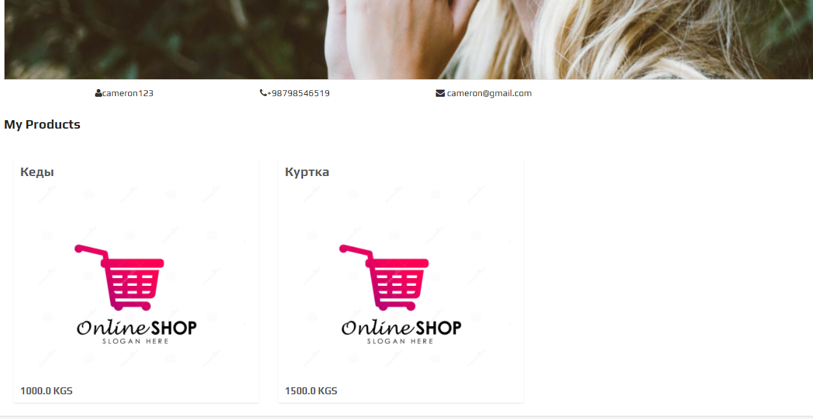
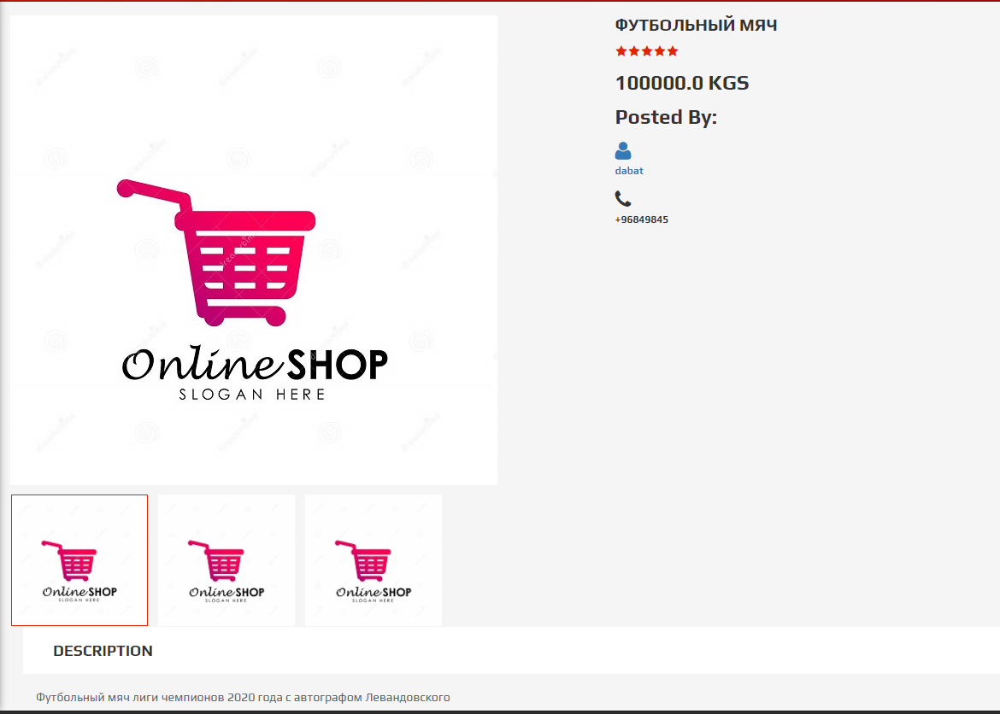
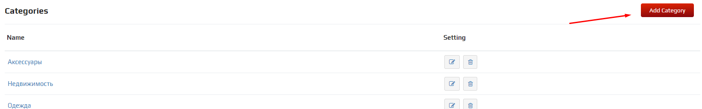

# kamilshop

Online Shoping Platform

https://kamilshop.herokuapp.com

## Used Technologies

* Java
* Spring Boot
* Maven  
* HTML, CSS, JavaScript
* Thymeleaf
* Postgresql
* Heroku
* Github

## API Endpoints

* "/" for home page
* "/login" for login
* "/signup" for signup
* "/category/list" for list of categories
* "/category/{id}/save" for create and save category
* "/category/{id}/delete" for deleting category
* "/product/{categoryId}/list" for list of products of one category
* "/product/{id}/save" for create and save product
* "/product/{id}/details" for product details
* "/user/{id}/save" for create and save user
* "user/{id}/profile" for user profile

## User Guide

Home page lists all products:

Categories page lists all categories

And when you click on category the products in that category will be shown.

New user can sign up and sign in to add a product for sale

In user profile

there is user information and list his products

If you click on a product you will see product details

And finally Administrator can add categories

username: admin
password: admin

you can try to add some categories.

